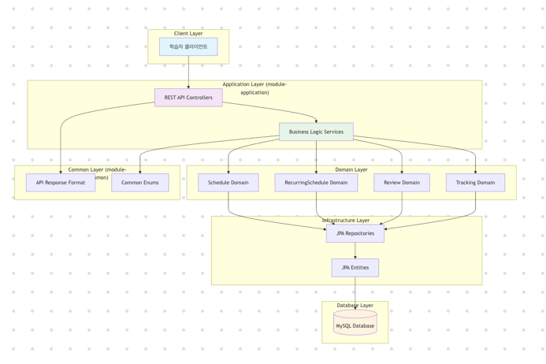
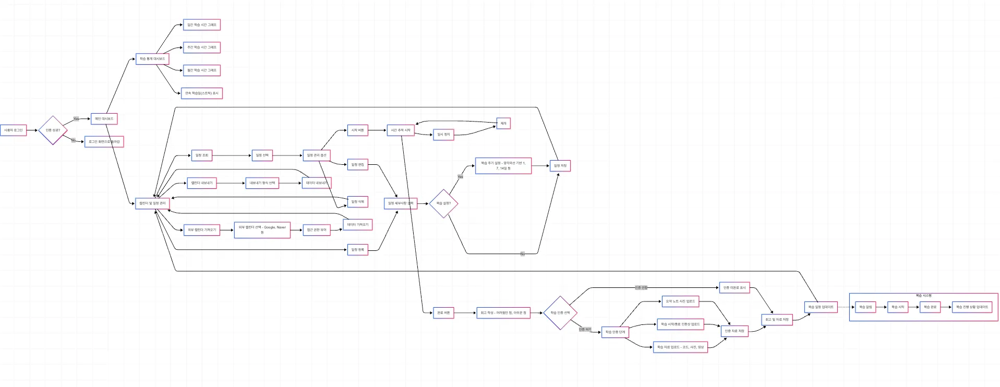
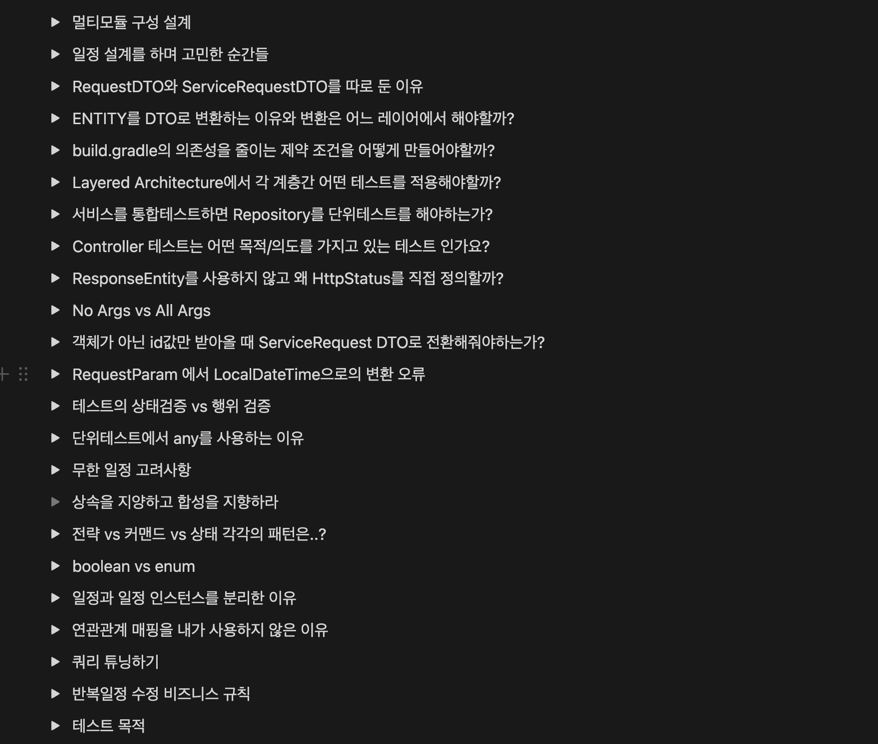

# Studdit - 학습 관리 시스템

스트릭 기반 학습 습관 형성과 망각곡선을 활용한 복습 일정 관리 시스템입니다.

## 📋 목차

- [프로젝트 소개](#-프로젝트-소개)
- [주요 기능](#-주요-기능)
- [기술 스택](#-기술-스택)
- [프로젝트 구조](#-프로젝트-구조)
- [시스템 아키텍처](#-시스템-아키텍처)
- [시작하기](#-시작하기)
- [API 명세](#-api-명세)
- [사용 시나리오](#-사용-시나리오)
- [개발 과정](#-개발-과정)

## 🎯 프로젝트 소개

Studdit은 효과적인 학습 습관 형성을 도와주는 학습 관리 시스템입니다. 연속 학습일(스트릭) 추적과 망각곡선 기반 복습 일정 자동 생성을 통해 사용자의 지속적인 학습을 지원합니다.

### 핵심 가치
- **습관 형성**: 스트릭 시스템으로 꾸준한 학습 습관 유도
- **효율적 복습**: 망각곡선 기반 자동 복습 일정 생성
- **학습 추적**: 상세한 학습 시간 및 통계 제공
- **인증 시스템**: 학습 자료 업로드를 통한 학습 인증

## ✨ 주요 기능

### 📅 일정 관리
- **단일 일정**: 일회성 학습 일정 등록 및 관리
- **반복 일정**: 매일/매주/매월 반복 일정 설정
- **복습 일정**: 망각곡선 기반 자동 복습 일정 생성 (1일, 7일, 14일, 30일)

### 📊 학습 추적
- **실시간 타이머**: 학습 시간 추적 (시작/일시정지/완료)
- **통계 대시보드**: 일간/주간/월간 학습 시간 분석
- **스트릭 시스템**: 연속 학습일 추적 및 동기부여

### 📝 학습 기록
- **회고 시스템**: 학습 후 회고 작성 (어려웠던 점, 아쉬운 점 등)
- **인증 시스템**: 학습 자료, 인증샷, 요약 노트 업로드

### 🔄 복습 관리
- **자동 복습 생성**: 망각곡선 기반 복습 일정 자동 설정
- **복습 완료 추적**: 복습 진행 상황 모니터링

## 🛠 기술 스택

### Backend
- **Java 17**
- **Spring Boot 3.4.4**
- **Spring Web** - REST API 개발
- **Spring Data JPA** - 데이터 접근 계층
- **Spring Validation** - 입력 검증
- **Lombok** - 코드 간소화

### Database
- **MySQL 8.0** - 관계형 데이터베이스

### DevOps
- **Docker & Docker Compose** - 컨테이너화
- **Gradle** - 빌드 도구

### Testing
- **JUnit 5** - 단위 테스트
- **Spring Boot Test** - 통합 테스트

## 🏗 프로젝트 구조

```
studdit/
├── module-application/     # 애플리케이션 계층
│   ├── controller/ 
│   ├── service/
│   ├── request/ 
│   └── response/  
├── module-db/             # 데이터 접근 계층
│   ├── entity/ 
│   └── repository/
├── module-common/         # 공통 모듈
│   └── ApiResponse.java
├── module-internal/       # 내부 서비스 모듈
└── module-independant/    # 독립 실행 모듈
```

### 주요 도메인
- **Schedule**: 학습 일정 관리 (단일 일정)
- **RecurringSchedule**: 반복 일정 관리
- **Review**: 복습 일정 관리
- **Tracking**: 학습 시간 추적

## 🏛 시스템 아키텍처

### 전체 시스템 구조

<br>

### 서비스 시나리오



### 계층별 설명

#### 🎯 Presentation Layer (Controller)
- REST API 엔드포인트 제공
- 요청/응답 데이터 변환
- 입력 검증 및 예외 처리

#### 🔧 Application Layer (Service)
- 비즈니스 로직 구현
- 트랜잭션 관리
- 도메인 객체 조작

#### 🏗 Domain Layer
- 핵심 비즈니스 규칙
- 도메인 모델 정의
- 망각곡선 알고리즘

#### 💾 Infrastructure Layer
- 데이터 영속성
- 외부 시스템 연동
- JPA 엔티티 매핑

## 🚀 시작하기

### 사전 요구사항
- Docker & Docker Compose
- Java 17 (로컬 개발 시)

### 실행 방법

1. **리포지토리 클론**
```bash
git clone [repository-url]
cd studdit
```

2. **Docker로 실행**
```bash
docker-compose up -d
```

3. **서비스 확인**
- Backend API: http://localhost:8080
- MySQL: localhost:3306

### 로컬 개발 환경 설정

1. **데이터베이스 설정**
```bash
# MySQL 실행 (Docker 사용)
docker-compose up db -d
```

2. **애플리케이션 실행**
```bash
./gradlew :module-application:bootRun
```

## 📚 API 명세

### 일정 관리
- `POST /api/schedules` - 일정 생성
- `GET /api/schedules` - 일정 조회
- `PUT /api/schedules/{id}` - 일정 수정
- `DELETE /api/schedules/{id}` - 일정 삭제

### 반복 일정
- `POST /api/recurring-schedules` - 반복 일정 생성
- `GET /api/recurring-schedules` - 반복 일정 조회
- `PUT /api/recurring-schedules/{id}` - 반복 일정 수정

### 복습 관리
- `POST /api/reviews` - 복습 일정 생성
- `GET /api/reviews` - 복습 일정 조회
- `PUT /api/reviews/{id}` - 복습 완료 처리

### 학습 추적
- `POST /api/tracking` - 학습 시작
- `PUT /api/tracking/{id}/pause` - 학습 일시정지
- `PUT /api/tracking/{id}/complete` - 학습 완료


## 💡 개발 과정

이 프로젝트는 단순한 기능 구현을 넘어서 **학습자 중심의 사용성**과 **확장 가능한 아키텍처**를 고려하여 개발되었습니다. 모든 설계 결정과 고민 과정을 Notion에 상세히 기록하여 추후 증거물로 제출할 예정입니다.

### 🤔 주요 설계 고민사항

#### 1. **일정 관리 구조 설계**
**고민**: 단일 일정과 반복 일정을 하나의 테이블로 통합할지, 분리할지에 대한 딜레마
- **통합 방안**: 하나의 Schedule 테이블에 반복 정보를 포함하는 컬럼 추가
- **분리 방안**: SingleSchedule과 RecurringSchedule을 별도 테이블로 관리

**최종 결정**: **분리 설계 채택**
- 이유: 단일 책임 원칙(SRP) 준수
- 각 도메인의 독립적인 확장성 확보
- 복잡한 반복 규칙과 단순한 일회성 일정의 명확한 구분

#### 2. **멀티모듈 아키텍처 도입**
**고민**: 프로젝트 규모 대비 멀티모듈의 필요성과 복잡성 증가
- **장점**: 계층 분리, 의존성 관리, 재사용성 향상
- **단점**: 초기 설정 복잡도, 작은 프로젝트 대비 오버엔지니어링 우려

**최종 결정**: **멀티모듈 아키텍처 채택**
- 확장 가능성을 고려한 미래 지향적 설계
- 각 계층의 명확한 역할 분담
- 팀 협업 시 모듈별 독립적 개발 가능


### 🔍 기술적 도전과 학습

#### 1. **Spring Boot 3.x 적용**
- Java 17 기반의 최신 Spring Boot 활용
- JPA Auditing을 통한 생성/수정 시간 자동 관리

#### 2. **Docker 컨테이너화**
- 개발 환경 통일을 위한 Docker Compose 구성
- MySQL 의존성 관리 및 헬스체크 구현
- 환경 변수를 통한 설정 관리

#### 3. **테스트 주도 개발 시도**
- 각 서비스 계층별 단위 테스트 작성
- Controller 통합 테스트를 통한 API 동작 검증
- Mock을 활용한 의존성 격리 테스트

### 📚 학습 성과 및 인사이트

#### 아쉬운 점과 개선 방향
- **성능 최적화**: 캐싱, 쿼리 최적화 등 성능 개선 여지
- **모니터링**: 로깅, 메트릭 수집 체계 도입 필요

### 📝 문서화 및 기록

모든 개발 과정의 **상세한 고민과 의사결정 과정**은 Notion에 체계적으로 기록하였습니다:
- 기술 스택 선정 이유
- 아키텍처 설계 과정
- 각 기능별 구현 방식 검토
- 발생한 문제와 해결 방법
- 코드 리뷰 및 리팩토링 과정

